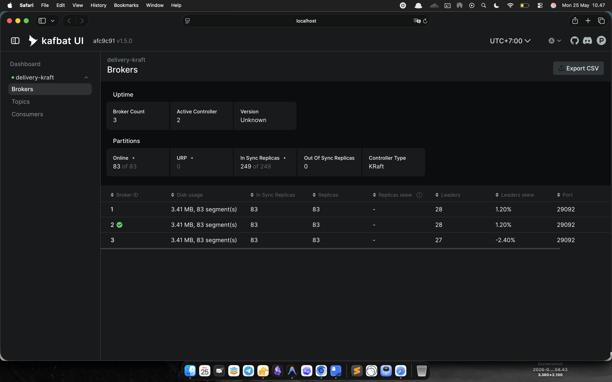
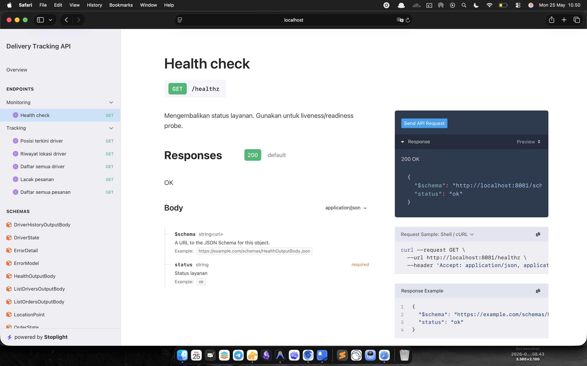
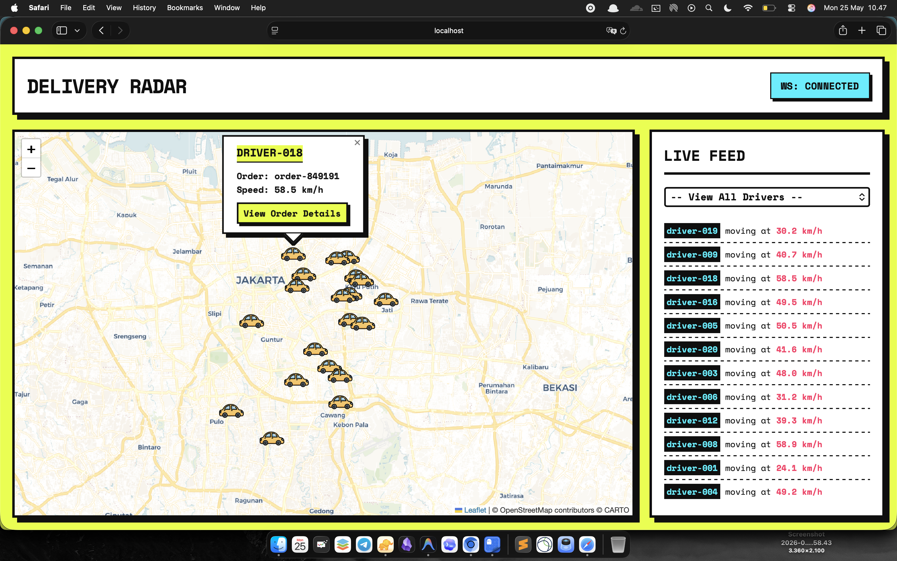
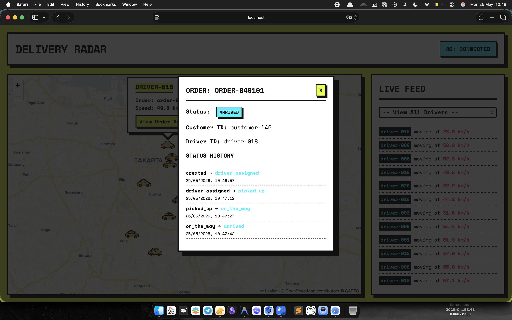

# Delivery App — Kafka Live Tracking

Studi kasus Kafka untuk delivery app: real-time driver location + order status tracking.

## Table of Contents
- [Demo & Screenshots](#demo--screenshots)
- [Stack](#stack)
- [Struktur](#struktur)
- [Cara Pakai](#cara-pakai)
- [Arsitektur & Best Practices](#arsitektur--best-practices)
- [Debug Commands](#debug-commands)
- [Kafka UI](#kafka-ui)
- [Testing High Availability (Broker Down Scenario)](#testing-high-availability-broker-down-scenario)

---

## Demo & Screenshots

### 1. Kafka UI Dashboard


### 2. Huma OpenAPI Docs


### 3. Real-Time Tracking UI (Brutalist Design)


### 4. Order Details Modal


---

## Stack
- **Kafka 3.9** — KRaft mode (tanpa ZooKeeper), 3 broker
- **Go** + [franz-go](https://github.com/twmb/franz-go)
- **Kafka UI** di `http://localhost:8080`

## Struktur

```text
delivery-kafka/
├── compose.yml              # 3-broker KRaft cluster + Kafka UI
├── go.work                  # Go Workspace untuk manage multi-module
├── schema/                  # Shared models & event envelopes
│   └── models.go            # Struct EventEnvelope, LocationPayload, dsb.
├── scripts/
│   └── init-topics.sh       # Buat semua topics dengan best practice config
├── producer/                # Simulasi banyak driver (location + order status)
│   ├── main.go              # Setup producer & root logic
│   ├── driver.go            # Simulasi pergerakan GPS & state driver
│   ├── kafka.go             # Inisialisasi Kafka client & record building
│   └── helpers.go           # ID generator
├── consumer/                # Consumer Kafka + REST API live tracking
│   ├── main.go              # Setup consumer & root logic
│   ├── api.go               # Huma v2 + Chi REST API routing
│   ├── kafka.go             # Kafka polling loop & DLQ handler
│   ├── store.go             # In-memory TrackingStore & state
│   ├── ws.go                # WebSocket hub untuk live map updates
│   └── templates/           # UI frontend resources (HTML/CSS/JS)
└── Makefile                 # Shortcut semua perintah
```

## Cara Pakai

### 1. Jalankan Kafka Cluster
```bash
make up
```
Tunggu ~15 detik sampai cluster siap.

### 2. Buat Topics
```bash
make init-topics
```

### 3. Terminal 1 — Producer
```bash
make deps       # download dependencies (sekali saja)
make producer
```

### 4. Terminal 2 — Consumer + API
```bash
make consumer
```

### 5. Test API
```bash
# Status pesanan + posisi driver
curl http://localhost:8081/track/order/order-000123

# Posisi terbaru driver
curl http://localhost:8081/track/driver/driver-001

# Rute history driver (10 titik terakhir)
curl http://localhost:8081/track/driver/driver-001/history

# Health check
curl http://localhost:8081/healthz
```

---

## Arsitektur & Best Practices

Sistem tracking pengiriman (*delivery tracking*) ini dirancang untuk menangani aliran data yang terus menerus dengan tingkat keandalan yang tinggi. Untuk mencapai hal tersebut, kami menerapkan berbagai *best practices* dalam penggunaan Kafka, mulai dari desain topik, struktur pesan, hingga konfigurasi pada tingkat *producer*, *consumer*, dan *cluster*. 

Berikut adalah penjabaran mendalam mengenai arsitektur dan pola produksi yang diterapkan:

### 1. Desain Topik & Naming Convention

Penamaan topik (*topic naming*) sangat krusial dalam sistem berbasis event karena mencerminkan domain bisnis dan jenis kejadian (*event*). Kami menggunakan pola penamaan standar: `{domain}-{entity}-{event-type}`.

> **Note**: Kami konsisten menggunakan karakter hyphens/strip (`-`) sebagai pemisah kata, alih-alih menggunakan titik (`.`) atau *underscore* (`_`). Hal ini karena metrik internal Kafka menerjemahkan baik titik maupun *underscore* menjadi karakter *underscore*. Jika ada topik `delivery.driver` dan `delivery_driver`, keduanya akan menghasilkan nama metrik `delivery_driver` yang sama, memicu *warning* `Due to limitations in metric names...` dan membuat pemantauan menjadi rancu. Penggunaan *hyphens* sepenuhnya menghindari masalah *metric collision* ini.

**Daftar Topik Utama:**
- `delivery-driver-location-updated`: Mencatat setiap pembaruan koordinat GPS dari *driver* secara real-time.
- `delivery-order-status-changed`: Mencatat transisi status pesanan (misal: dari *processing* menjadi *delivering*).
- `delivery-order-created`: Mencatat saat pesanan baru masuk ke dalam sistem.
- `delivery-order-driver-assigned`: Mencatat penugasan seorang *driver* ke sebuah pesanan.
- `delivery-dlq-failed-events`: *Dead Letter Queue* (DLQ) khusus untuk menampung pesan-pesan cacat yang gagal diproses.

### 2. Strategi Partition Key

Pemilihan `Partition Key` menentukan bagaimana pesan didistribusikan ke dalam partisi Kafka. Pemilihan *key* yang tepat menjamin pengurutan data (*ordering guarantee*) yang sangat penting dalam sistem pelacakan.

| Topik | Partition Key | Rasionalisasi & Dampak |
|-------|---------------|------------------------|
| `*-location-updated` | `driver_id` | Pesan lokasi dikirim sangat cepat. Dengan `driver_id` sebagai key, seluruh pembaruan lokasi dari satu *driver* yang sama dipastikan masuk ke **partisi yang sama**. Karena Kafka menjamin urutan pesan dalam satu partisi, posisi pergerakan *driver* di peta tidak akan pernah melompat mundur secara tiba-tiba akibat *race condition* antar *consumer*. |
| `*-status-changed` | `order_id` | Siklus hidup sebuah pesanan (Dibuat -> Driver Ditugaskan -> Diambil -> Selesai) harus diproses berurutan. Menggunakan `order_id` menjamin urutan transisi status (*state transition*) secara mutlak. |

### 3. Struktur Pesan: Pola Event Envelope

Alih-alih mengirimkan JSON yang bentuknya berubah-ubah, semua kejadian dibungkus dalam sebuah arsitektur pola **Event Envelope**. Pola ini memberikan meta-informasi yang kaya tanpa harus membongkar seluruh isi (*payload*) pesan.

```json
{
  "event_id":   "1718123456789-42",       // ID unik untuk pelacakan (traceability) & deduplikasi
  "event_type": "driver.location.updated",// Jenis event, membantu routing di sisi consumer
  "version":    1,                        // Versi skema, krusial untuk backward/forward compatibility
  "timestamp":  "2025-06-01T10:00:00Z",   // Waktu aktual kejadian (event time)
  "source":     "driver-tracking-service",// Identitas layanan pengirim
  "payload": {                            // Data spesifik yang bervariasi sesuai event_type
    "driver_id": "driver-001",
    "order_id":  "order-000123",
    "latitude":  -6.2088,
    "longitude": 106.8456,
    "bearing":   45.0,
    "speed_kmh": 35.2,
    "accuracy_m": 8.5
  }
}
```

### 4. Konfigurasi Producer: Kecepatan tanpa Kompromi Data

*Producer* bertugas menerima ribuan titik lokasi setiap detiknya. Konfigurasi difokuskan pada *throughput* maksimum sekaligus mencegah hilangnya data (*data loss*).

- **`acks=all` & `min.insync.replicas=2`**: Memaksa *producer* untuk menunggu konfirmasi tertulis dari minimal 2 *broker* yang berbeda sebelum menganggap pesan berhasil terkirim. Ini adalah standar emas untuk mencegah kehilangan data jika terjadi *crash* pada server.
- **Idempotent Producer Aktif**: Memastikan tidak ada duplikasi data akibat *network retry*. Jika koneksi terputus sesaat setelah pesan terkirim (tapi belum dikonfirmasi), *producer* dapat mencoba lagi secara aman (`RequiredAcks(kgo.AllISRAcks())`); Kafka akan membuang duplikatnya.
- **Batching & Linger (`linger.ms=5`)**: Daripada mengirim pesan satu per satu yang menguras *network I/O*, *producer* menahan pengiriman selama maksimal 5 milidetik (`kgo.ProducerLinger(5 * time.Millisecond)`) untuk menggabungkan banyak titik lokasi ke dalam satu kumpulan (*batch*). Strategi ini meningkatkan *throughput* secara eksponensial.
- **Kompresi LZ4**: Algoritma ini dipilih (`kgo.ProducerBatchCompression(kgo.Lz4Compression())`) karena sangat ringan di CPU tapi ampuh mengecilkan ukuran data JSON berulang, menekan latensi jaringan secara signifikan.
- **Async Produce & Retry**: Pengiriman dilakukan di *background* (*asynchronous*) agar aplikasi tidak tertahan (*blocking*), dipadukan dengan strategi *exponential backoff* saat jaringan tidak stabil.

### 5. Konfigurasi Consumer: Tangguh Menghadapi Beban

Sistem *consumer* di ujung lain menerima aliran data masif untuk ditampilkan di peta, menyimpan ke database, dan dikalkulasi secara *real-time*.

- **Horizontal Scalability (Consumer Group)**: Menggunakan *group* `tracking-api-service`. Saat beban GPS meningkat (misal jam sibuk), Anda tinggal menjalankan *instance* *consumer* lebih banyak. Kafka akan membagi rata partisi ke semua *instance* yang aktif secara otomatis.
- **Manual Offset Commit (At-Least-Once)**: Fitur auto-commit dimatikan (`kgo.DisableAutoCommit()`). Sistem baru akan menggeser tanda baca (*offset*) Kafka **setelah** pemrosesan benar-benar tuntas (misal: WebSocket telah di-broadcast dan status *database* sudah diperbarui, `client.CommitUncommittedOffsets(ctx)`). Ini mencegah *data loss* bila aplikasi tiba-tiba *crash* di tengah jalan.
- **Static Membership (`instance.id`)**: Biasanya, saat *consumer restart* (misal saat proses *deployment* kode baru), Kafka akan menghentikan seluruh proses untuk menata ulang partisi (*Stop-The-World Rebalance*). Dengan ID Statis (`kgo.InstanceID(...)`), Kafka akan "menahan" partisi untuk *instance* tersebut dan menunggu sesaat, membuat proses *rolling restart* tidak terasa oleh pengguna.
- **Consumer Fetch Optimization**: Memaksa *consumer* untuk menunggu sejumlah data terkumpul (`kgo.FetchMinBytes(1_000_000)` dan `kgo.FetchMaxWait(500 * time.Millisecond)`) sebelum mengambilnya, mencegah pemborosan *round-trip* pada saat sistem sedikit lengang.
- **Dead Letter Queue (DLQ)**: Jika ada pesan dengan format JSON hancur (*poison pill*), sistem tidak akan macet/mengulang *error* terus menerus. Pesan rusak itu dilempar ke topik DLQ untuk diinvestigasi manual, dan proses pelacakan terus berjalan mulus.

### 6. Arsitektur Cluster Kafka: Standar High Availability

Cluster berjalan sepenuhnya pada mode KRaft (menghilangkan ketergantungan pada Apache ZooKeeper) untuk performa dan pengelolaan yang jauh lebih efisien.

- **Replication Factor (RF) = 3**: Setiap kepingan data memiliki 3 salinan fisik yang tersebar di mesin berbeda. Sistem sanggup bertahan meski 2 *broker* meledak/terbakar bersamaan.
- **Min In-Sync Replicas (min ISR) = 2**: Menjamin konsistensi data. Pesan baru akan ditolak (*failed fast*) jika jumlah salinan aktif kurang dari 2, mencegah data penting dicatat di *broker* yang setengah rusak.
- **Unclean Leader Election = False**: Memprioritaskan Konsistensi (C) di atas Ketersediaan (A) dalam teori CAP. Jika *broker* utama (*leader*) partisi mati, hanya *broker* yang memiliki data ter-sinkron penuh yang boleh menggantikannya, guna mencegah anomali data (misal: pesanan yang sudah *Delivered* mundur kembali menjadi *Processing*).
- **Auto Create Topics = False**: Praktik disiplin tinggi. Mencegah terciptanya topik siluman akibat salah ketik (typo) di sisi klien yang bisa menjadi "sampah tak terawat" membebani *cluster*.

---

## Debug Commands

```bash
make list-topics          # lihat semua topics
make describe-location    # detail konfigurasi topic lokasi
make peek-location        # baca 5 pesan lokasi dari terminal
make consumer-groups      # cek lag consumer group
make logs-kafka           # log semua broker
```

## Kafka UI
Buka `http://localhost:8080` untuk melihat topics, consumer groups, messages secara visual.

---

## Testing High Availability (Broker Down Scenario)

Cluster ini dirancang menggunakan 3 broker dengan `replication.factor=3` dan `min.insync.replicas=2`. Ini berarti cluster bisa mentoleransi kegagalan tepat **1 broker** tanpa ada data loss atau downtime.

Anda bisa mensimulasikan kegagalan broker dengan Docker:

### 1. Hard Crash (Satu Broker Mati)
Mensimulasikan server mati atau restart.
```bash
docker stop kafka-1
```
- **Hasil:** Producer dan Consumer akan tetap berjalan. Kafka otomatis memilih leader baru untuk partisi yang sebelumnya ditangani oleh `kafka-1`. Data tetap aman karena `min.insync.replicas=2` masih terpenuhi oleh `kafka-2` dan `kafka-3`.
- **Recovery:** `docker start kafka-1`

### 2. Network Partition / JVM Freeze (Satu Broker Freeze)
Mensimulasikan kondisi di mana server masih hidup namun tidak merespons (misal masalah jaringan atau JVM Garbage Collection pause).
```bash
docker pause kafka-2
```
- **Hasil:** Cluster akan menganggap `kafka-2` mati setelah beberapa saat karena tidak ada heartbeat. Producer mungkin mengalami sedikit delay retry, tapi kemudian lanjut memproses data.
- **Recovery:** `docker unpause kafka-2`

### 3. Cluster Outage (Dua Broker Mati)
Mensimulasikan bencana di mana lebih dari satu broker mati bersamaan.
```bash
docker stop kafka-1 kafka-2
```
- **Hasil:** Producer akan menolak mengirim pesan baru dan memunculkan error. Ini adalah perilaku yang diinginkan (fail-safe) karena `acks=all` tidak bisa dipenuhi (hanya 1 broker yang tersisa, padahal butuh minimal 2). Kafka melindungi data Anda dengan menolak write daripada mengambil risiko data loss.

---

### Membedah Metrik High Availability (Studi Kasus Broker Down)

Ketika Anda menyimulasikan kegagalan (*node failure*), Anda bisa melihat perubahan langsung pada metrik di *dashboard* Kafbat UI. Berikut adalah arti dari setiap metrik tersebut:

#### 1. Dinamika Controller & KRaft
* **Controller Type: KRaft:** Kafka menggunakan algoritma konsensus internal KRaft (Kafka Raft), bukan Zookeeper.
* **Active Controller:** Jika *broker* yang kebetulan sedang bertugas sebagai *Controller* (mandor) mati, KRaft akan langsung mendeteksi dan secara otomatis menunjuk *broker* yang masih hidup sebagai *Active Controller* baru dalam hitungan milidetik.

#### 2. Membedah Angka Merah: URP, ISR, dan OSR
Sebagai contoh di *dashboard* sering terlihat total **83 Partisi**. Dari mana angka ini?
- **33 Partisi Buatan:** Berasal dari *topic* yang kita buat (`location-updated`=12, `status-changed`=6, `order-created`=6, `driver-assigned`=6, `dlq`=3).
- **50 Partisi Internal:** Kafka otomatis membuat *topic* `__consumer_offsets` dengan *default* 50 partisi untuk melacak posisi baca dari *consumer group*.

Dengan **Replication Factor = 3**, total salinan yang harus ada adalah 249 ($83 \times 3$). Jika 1 *broker* mati, maka 83 salinan ikut hilang dari peredaran.
* **In Sync Replicas (ISR):** Jumlah salinan data yang saat ini sehat dan sinkron dengan *Leader*. (Misal: sisa 166 dari target 249).
* **Out of Sync Replicas (OSR):** Jumlah replika yang tertinggal atau berada di *broker* yang mati (Misal: 83 replika).
* **URP (Under Replicated Partitions) - Indikator Alarm:** Jumlah partisi yang jumlah replika aktifnya **kurang dari** target *Replication Factor*. Karena targetnya 3 tapi cuma tersisa 2, maka semua 83 partisi Anda berstatus *Under Replicated*. Ini adalah peringatan bahwa *cluster* sedang beroperasi dengan jaring pengaman yang berkurang.

#### 3. Tabel Keseimbangan Beban (Leaders Skew)
* **Leaders:** Setiap partisi hanya memiliki 1 *Leader* untuk *Read/Write*. Kafka membagi beban ini ke sisa *broker* yang hidup secara adil.
* **Leaders Skew:** Persentase ketidakseimbangan beban antar *broker*. Jika angkanya mendekati 0-1%, artinya distribusi *Leader* nyaris sempurna dan tidak ada *broker* yang kewalahan.

### Analogi Brankas (Memahami URP)

Bayangkan Anda punya aturan: *"Setiap data transaksi wajib disimpan ke dalam **3 brankas** di gedung berbeda."*

1. Tiba-tiba gedung tempat **Brankas 3** mati lampu (*broker down*).
2. **Apakah datanya hilang?** **Tidak.** Kita masih bisa melayani transaksi pakai Brankas 1 dan Brankas 2. Sistem tidak *down*.
3. **Apakah aturan terpenuhi?** **Tidak.** Aturannya butuh 3, tapi sekarang cuma ada 2 yang hidup. Kondisi inilah yang disebut **Under Replicated (URP)**.

Kafka mewarnai metrik URP dengan warna merah sebagai peringatan dini (*early warning*): *"Kita masih bisa beroperasi, tapi jaring pengaman kita robek satu. Segera hidupkan kembali server yang mati sebelum server kedua ikut mati dan menyebabkan kehilangan data."*
